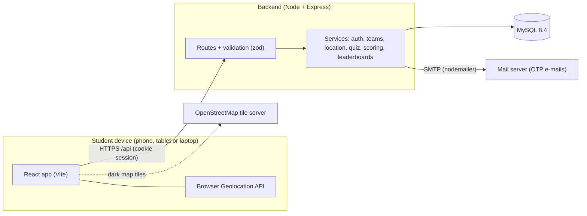
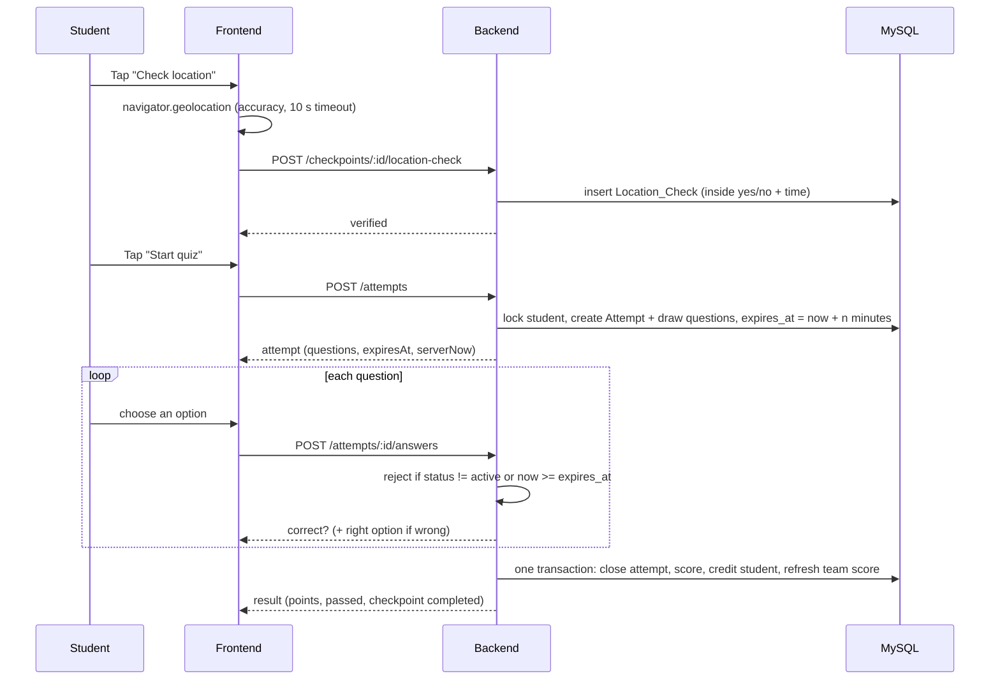

# Architecture Diagram

```mermaid
flowchart LR
    subgraph Phone["Student device (phone, tablet or laptop)"]
        UI["React app (Vite)"]
        GEO["Browser Geolocation API"]
        UI --- GEO
    end
    UI -- "HTTPS /api (cookie session)" --> API
    subgraph Server["Backend (Node + Express)"]
        API["Routes + validation (zod)"]
        SVC["Services: auth, teams, location, quiz, scoring, leaderboards"]
        API --> SVC
    end
    SVC --> DB[("MySQL 8.4")]
    SVC -- "SMTP (nodemailer)" --> MAIL["Mail server (OTP e-mails)"]
    UI -. "dark map tiles" .-> TILES["OpenStreetMap tile server"]
```

## Quiz request flow

```mermaid
sequenceDiagram
    participant S as Student
    participant F as Frontend
    participant B as Backend
    participant D as MySQL
    S->>F: Tap "Check location"
    F->>F: navigator.geolocation (accuracy, 10 s timeout)
    F->>B: POST /checkpoints/:id/location-check
    B->>D: insert Location_Check (inside yes/no + time)
    B-->>F: verified
    S->>F: Tap "Start quiz"
    F->>B: POST /attempts
    B->>D: lock student, create Attempt + draw questions, expires_at = now + n minutes
    B-->>F: attempt (questions, expiresAt, serverNow)
    loop each question
        S->>F: choose an option
        F->>B: POST /attempts/:id/answers
        B->>B: reject if status != active or now >= expires_at
        B-->>F: correct? (+ right option if wrong)
    end
    B->>D: one transaction: close attempt, score, credit student, refresh team score
    B-->>F: result (points, passed, checkpoint completed)
```
